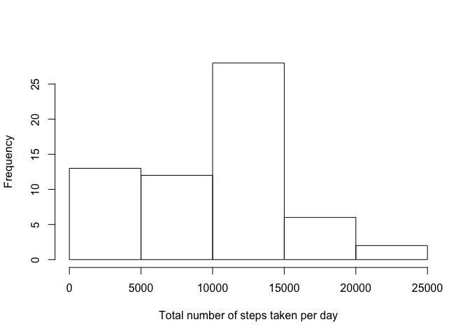
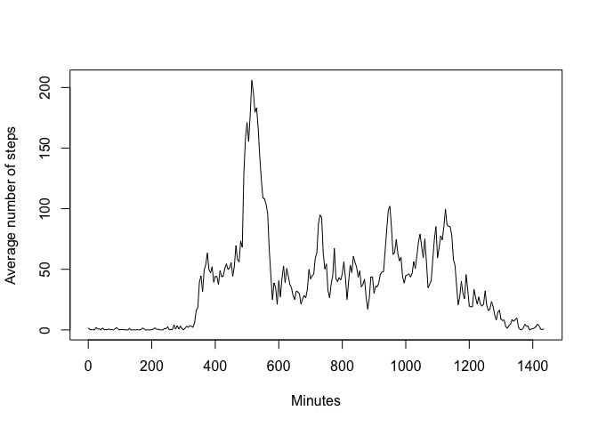
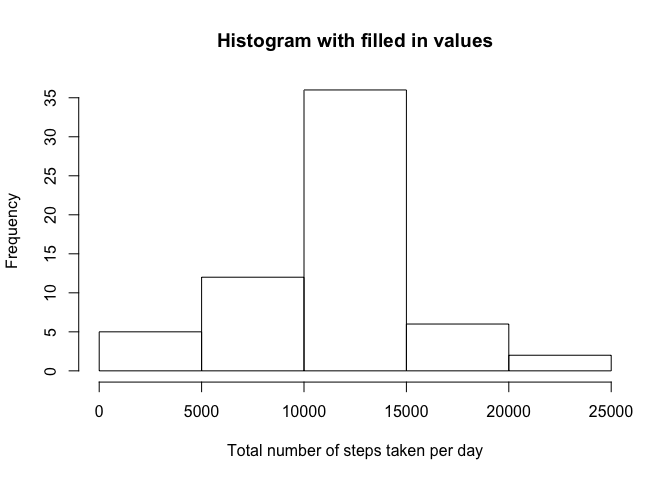
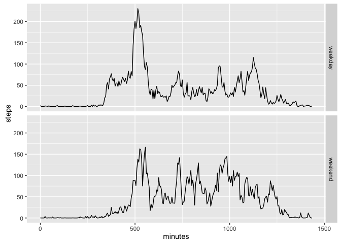

# Reproducible Research: Peer Assessment 1


## Loading and preprocessing the data

First we load the data.


```r
data<-read.csv("activity.csv",colClasses=c(NA,"Date",NA))
```

As the data looks fine, there is no need to preprocess the data.

## What is mean total number of steps taken per day?

We calculate the total number of steps taken per day, ignoring any missing values.

```r
tot<-tapply(data$steps,data$date,sum,na.rm=TRUE)
```

This is a histogram of the total number of steps taken per day.


```r
hist(tot,plot=TRUE,main=NULL,xlab="Total number of steps taken per day")
```

<!-- -->


```r
mean<-mean(tot)
median<-median(tot)
```

The mean of the total number of steps taken per day is 9354.2295082 and the median is 10395.

## What is the average daily activity pattern?

We want to know the number of steps taken in each 5-minute interval averaged across all the days.


```r
daily<-tapply(data$steps,data$interval,mean,na.rm=TRUE)
```

To make this into a time-series plot, we need to be somewhat careful because the labels for the intervals are not formatted properly. For instance, the x value jumps from 55 to 100 and so on at every 55 minute mark. We could transform them into time objects, but for the sake of simplicity we will count the number of minutes elapsed since midnight. Therefore, x will run from 0 to 1435 (there are 1440 minutes in a day) in 5-minute increments.


```r
plot(seq(0,1435,5),daily,type="l",ylab="Average number of steps",xlab="Minutes")
```

<!-- -->

Which 5-minute interval has the maximum number of steps?


```r
which.max(daily)
```

```
## 835 
## 104
```

The 5-minute interval with the maximum average number of steps taken is 8:35 to 8:40.

## Imputing missing values

How many missing values are there?


```r
sum(is.na(data))
```

```
## [1] 2304
```

Visual inspection of the dataset suggests that the NAs occur grouped in entire days and are not scattered about. Therefore we insert the average number of steps in a 5-minute interval averaged across the entire dataset for the missing values.


```r
for(i in seq_along(data$steps)){
    if (is.na(data$steps[i])) data$steps[i]<-daily[match(data$interval[i],names(daily))]
}
```

Now we can simply repeat the first part of this assignment with the new data.


```r
tot2<-tapply(data$steps,data$date,sum,na.rm=TRUE)
```


```r
hist(tot2,plot=TRUE,main="Histogram with filled in values",xlab="Total number of steps taken per day")
```

<!-- -->

The new mean and median are as follows:


```r
mean(tot2)
```

```
## [1] 10766.19
```

```r
median(tot2)
```

```
## [1] 10766.19
```

How can we interpret these results?

Let's find out which of the original totals were 0.


```r
which(tot==0)
```

```
## 2012-10-01 2012-10-08 2012-11-01 2012-11-04 2012-11-09 2012-11-10 
##          1          8         32         35         40         41 
## 2012-11-14 2012-11-30 
##         45         61
```

We strongly suspect that these days were the days with all NAs, since there are 8 days and 288 times 8 is 2304, the number of NAs. In fact:


```r
tot2[which(tot==0)]
```

```
## 2012-10-01 2012-10-08 2012-11-01 2012-11-04 2012-11-09 2012-11-10 
##   10766.19   10766.19   10766.19   10766.19   10766.19   10766.19 
## 2012-11-14 2012-11-30 
##   10766.19   10766.19
```

This shows that those NA days are replaced with the average day. In other words, the 8 days that counted as days with 0 steps taken have become days with the mean number of steps taken. From the histogram, we verify that the frequency for 0-5000 is now 5 instead of 13 and the 10000-15000 cell has gained 8 days. In conclusion, the number of days with low total steps taken were over-represented because of the presence of NAs.

## Are there differences in activity patterns between weekdays and weekends?

Let's first append a factor column with two levels 'weekday' and 'weekend'.


```r
data$day<-factor(grepl("S",weekdays(data$date)),labels=c("weekday","weekend"))
```

Now we make a multipanel plot comparing the steps taken on weekends and during weekdays.


```r
require(reshape2)
```

```
## Loading required package: reshape2
```

```r
require(ggplot2)
```

```
## Loading required package: ggplot2
```

```r
daily2<-tapply(data$steps,list(data$interval,data$day),mean)
melted<-melt(daily2,varnames=c("interval","day"),value.name="steps")
qplot(rep(seq(0,1435,5),2),steps,data=melted,geom="line",facets=day~.,xlab="minutes")
```

<!-- -->

The main difference seems to be that there are more steps taken during morning hours on weekdays, which intuitively makes sense.
